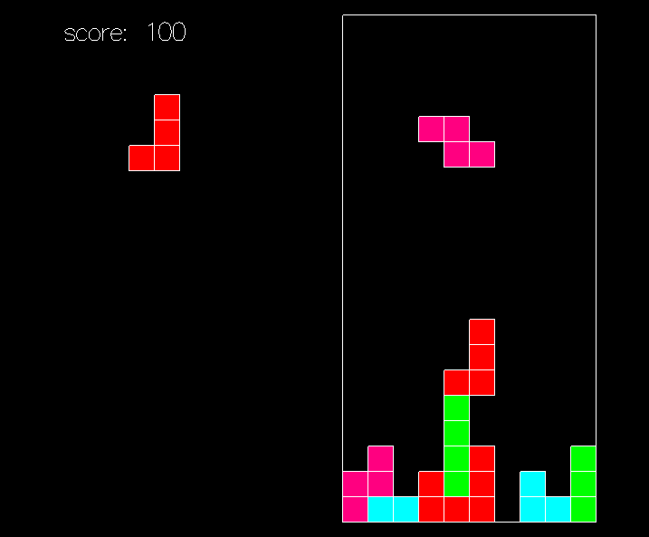

# haskell-tetris

# Installation

Download [Haskell Platform](https://www.haskell.org/platform/) 
 
Then in the directory  
`stack setup`  
`stack build`  
`stack run`

# Controls

UP - rotate the shape  
LEFT, RIGHT, DOWN - move the shape  
SPACE - pause or restart the game at the end  